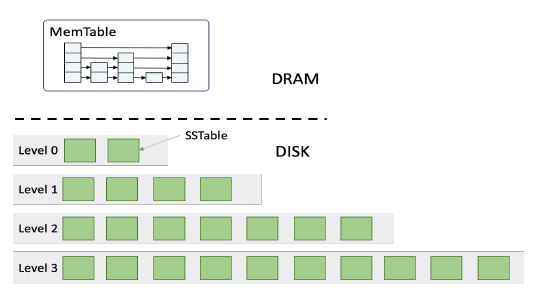
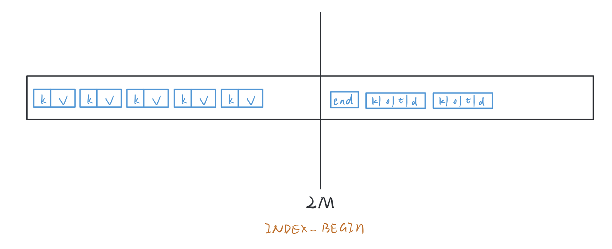
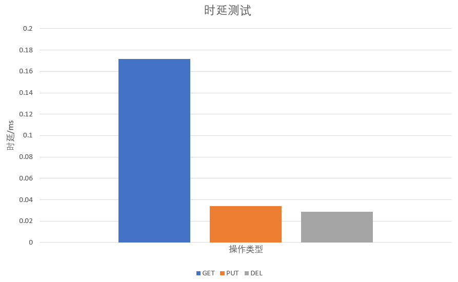
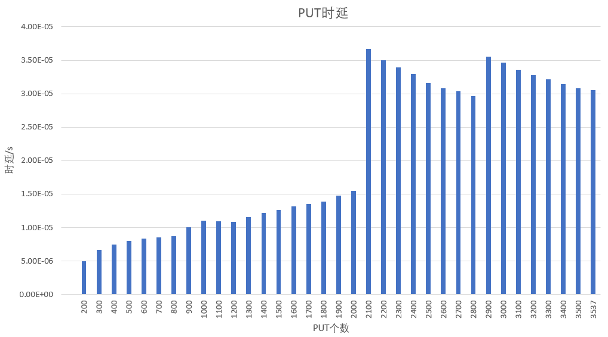
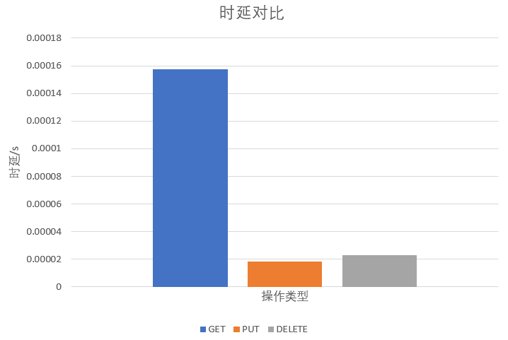
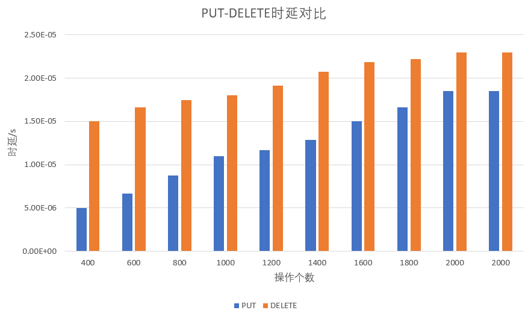
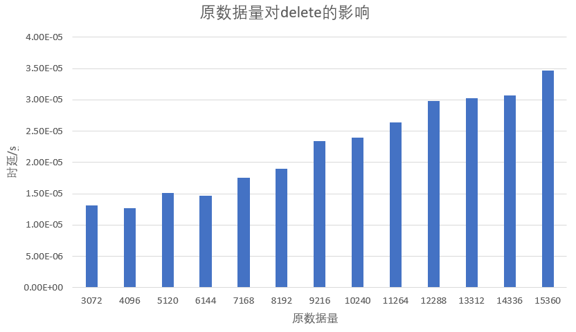
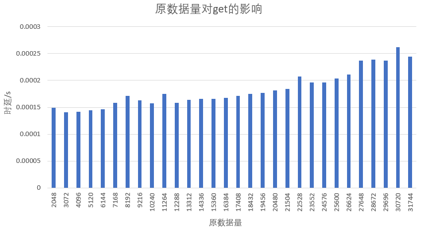
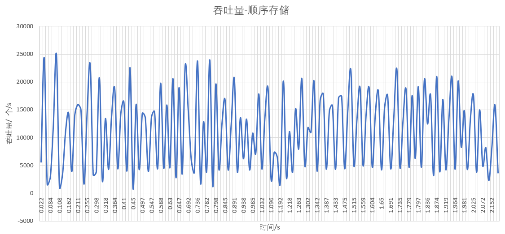
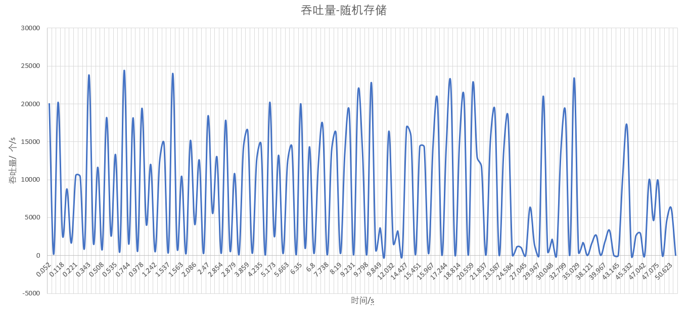

# LSM Tree 键值存储系统设计文档
518021910789 刘书畅

## 1. 项目概况
本项目将基于LSM Tree开发一个简化的键值存储系统。支持以下基本操作：
 - PUT(K,V)设置键K的值为V
 - GET(K)读取键K的值
 - DELETE(K)删除键K的值
 
其中K是64位有符号整数，V位字符串 
 
 ## 2. 基本结构
 
 
 
 　LSM Tree的键值存储系统分为内存存储和硬盘存储两部分。  
 　内存部分由跳表实现，控制跳表结构的大小为最大2M当跳表中存储的数据量超过2M时，将会写入文件，并清空跳表。  
 　硬盘部分采用分层存储，每层包含多行文件：第0层最多2个文件，第1层最多4个文件，第2二层最多8个文件……
 每个文件分数据区和索引区，索引区同时也存入内存。
 
 ## 3. 内存结构——跳表
 
　　跳表结构内部由沿横向分层、沿纵向相互耦合的多个列表组成。每层的水平列表由四联表实现，同层节点按关键码排序，
 每层列表都设有头、尾哨兵。  
 　　层次不同的节点沿纵向组成成塔，同塔内的节点以高度为序也定义了前驱和后继。塔由概率形成，是为了方便查找
   
 
 　　本项目的跳表功能由以下几个文件实现：
 
 ```
 #include "Mynode.h"
 #include "Quadlist.h"
 #include "Skiplist.h"
 ```
  　　Mynode.h实现了键值对存储结构和跳表中的四联表节点。四联表节点具有前驱、后继、上驱、下继。  
  　　Quadlist.h实现了每层的列表，由Mynode.h中定义的节点形成。  
  　　Skiplist.h继承了list类，每个元素由四联表组成，存储跳表的各个层。  
  
  以下阐述本项目跳表设计的特殊几点。
   
### Quadlistnode
　　四联表的节点除了记录存入的键值对和前驱、后继、上驱、下继外，还记录了del(是否被删除)。如果执行delete(K)
，若在跳表中查询到键为K的键值对的存在，不能简单的直接删除，因为这样不能删除文件系统中已有的键为K的记录，
应在跳表中插入键为K，值为空，并标记为删除的节点。  
```
struct Quadlistnode{
    Entry entry;
    bool del;
    QuadlistnodeP pred;
    QuadlistnodeP succ;
    QuadlistnodeP above;
    QuadlistnodeP below;
   
};
```  
### cap()
　　cap()函数计算跳表的内存占用量，当跳表的大小超过2M时就要写进文件，清空跳表。  


## 4. 文件系统——sstable
    
  　　一个文件分为前面的数据区，后面的索引区，规定INDEX_BEGIN(2M)为索引区开始位置。数据区存放K-V对。索引区
  开头存放end(为unsigned int 类型)，记录数据区数据结束的位置。紧接着存放索引，存放内容包括：key(键)，offset
  (该键值对在文件中存放位置距离ios::beg的偏移量)，timer(该键值对的时间戳)，del(是否被删除)。索引区也在内存
  中存放。  
  ```
class LSM_tree {
    vector<Level*> disk;  //记录各个层的所有文件的索引区信息
    unsigned int timer;   //标记现在时间timer
    Skiplist memtable;    //跳表
}

class Level {
public:
    int level_id;           //标记这是第几层
    bool *is_creat;         //标记各个文件是否已创造
    vector<Sstable*> file;  //标记各个文件的素引区信息
}

```
### PUT
1. 用户输入插入命令put(k,v)
2. 检查跳表的内存占用大小，若插入该键值对大小超过2M，则先将该跳表写入文件，并清空跳表后再插入。写入
文件生成索引区时，该跳表的所有键值对的时间戳都记录为此时LSM Tree记录的时间
3. 在memtable(跳表)结构中查询，有没有键为k的键值对，若有直接覆盖，若无则插入。
4. 检查第0层的文件数量是否超出限额，若超出则递归合并。
```
void LSM_tree::put(uint64_t key, const std::string &s, bool d)
bool Level::flush_to_file(Skiplist &memtable, unsigned int timer)
void LSM_tree::compaction() 
```

### DELETE
1. 用户输入命令delete(k)
2. 执行put(k,""",true) 　第３个参数true表示标记为删除
```
bool LSM_tree::del(uint64_t key) {
    if (!find(key)) return false;
    std::string s;
    put(key, s, true);
    return true;
}
```

### GET
1. 用户输入get(k)
2. 先检查跳表中有无k,并检查是否标记为删除。若存在k，并标记为删除，返回空值；若存在k，标记为未删除，则
返回value
3. 若跳表中没有找到k，则要去文件系统的索引区查找，找到时间戳timer最大的值，去文件里获得它的值。
```
std::string LSM_tree::get(uint64_t key)
```

### COMPACTION
1. 若检查第0层的文件数量超出限额，则执行合并
2. 先将第0层的文件全都读进内存，并进行归并，相同key的按时间戳为大取。将合并后的vector temp传递给第1层
3. 第一层寻找key与temp有重叠的文件，全都读进内存进行归并
4. 在该层寻找空文件将归并完的数组进行写入，并生成索引区，同时也将索引区写入。若第一层写满后，temp仍有值
则传给下一层继续进行递归合并，否则停止递归
```
void LSM_tree::compaction() 
void LSM_tree::compaction_level_0() 
void LSM_tree::compaction_level(int level, vector<sortNode *> *temp)
vector<sortNode *> *LSM_tree::sort_merge(vector<vector<sortNode *> *> &need_to_cpct) 
```

## 5. 性能测试
### 测试环境
- 机型：小米笔记本电脑 PRO
- 处理理器器：Intel(R) Core(TM) i7-8550U CPU @ 1.80GHz 2.00GHz
- 内存： 8.00 GB (7.89 GB可用)
- 硬盘： 256G PCIe SSD
- 操作系统： 64位 windows10

### 1.正确性测试
通过
### 2. 性能测试
#### 时延
　　在正常情况下(无compaction)，PUT,GET,DELETE操作所需要的平均时间。
##### ①测试参数与方法
　　1. 考虑put操作相较delete函数更容易发生compaction和flush_to_file。三种操作分别进行TEST_NUM=3072次(该次数情况下put操
作会发生flush_to_file，而delete不会)，记录TEST_NUM次测试里面，不发生compaction的操作的总时间和次数，最后求出平均值。在LSM_Tree类中
添加公有数据成员compact记录有无发生合并。而对于delete操作和get操作，原树中已有数据量的大小是会对操作耗时产生影响的，已有
。此处控制原数据量均为10240个，put操作从原数据为0个的时候开始。原数据量对delete和get的影响在3中进行
讨论和分析。  
　　2. 排除flush_to_file的影响控制操作次数为400到2000，这写操作次数范围内，PUT和DELETE都不会发生flush_to_file。控制delete
和get的原数据量为10240个。  
　　3. 控制原数据(在delete或get操作前，数据结构中已有数据量)，探究2024次delete和get操作的平均耗时。

 
　　使用#include <time.h>库中的clock()函数记录操作所需时间。
##### ②测试结果与分析
1. 三种操作分别进行TEST_NUM=3072次
 
　　有测试结果图可以看出，在正常情况(不考虑compaction)下DELETE操作平均用时最少，PUT操作次之，GET操作最为耗时。GET操作耗时
最多是因为，每次get操作，如果查询成功(key存在)，则必然引发一次文件读写，文件读写较为耗时。而put,delete操作，可能不会引发文件
读写。
　　但是考虑到PUT操作会涉及到flush_to_file,也就是当跳表中达到存储限额时，要将跳表写入文件，又单独测试了PUT操作
在不考虑compaction时，不同操作次数的平均耗时。
 
　　由该图可以看出，PUT操作的平均耗时并不是随操作次数的增多平稳上升的，在图中有两个峰值，分别是操作次数为2100，
2900时出现的。据分析，这几次峰值出现的原因是，跳表中数据存储达到阈值，需要进行flush_to_file，将跳表的数据写入文件，涉及
到文件读写，增加了PUT操作的耗时。  
　　影响put和delete相对用时的因素，据分析可能存在两个原因：1. put操作相较于delete操作更容易发生flush_to_file，
而flush_to_file操作涉及文件读写，所以更慢。delete操作相当于执行了put(key,"",true)操作,插入的value为空值，不容易发生
flush_to_file，所以delete操作用时比put操作用时稍短。 2. delete操作实际上是一次find(key)操作，加上一次put(key,"",true)操作，
所以用时可能比put操作长。  
　　根据实验结果，原因1即，flush_to_file对操作耗时影响更大。为探究以上第二种原因对耗时的影响，需控制put和delete均不发生
flush_to_file。
2. 三种操作分别进行TEST_NUM=2000次
 
　　在flush_to_file不发生的情况下，delete操作消耗时间略大于put操作，据分析，delete操作实际上是一次find(key)操作，
加上一次put(key,"",true)操作，在不发生flush_to_file的情况下，用时比put操作长。 
  
　　 
3. 对于delete和get操作控制原数据量
  
 　　由上图可知，delete操作平均耗时随原数据量的增大而增大。据分析，是因为delete操作实际上是一次find(key)操作，
 加上一次put(key,"",true)操作，而find操作耗时和数据结构中原数据量有关，原数据量越大，消耗时间越长。
   
  　由上图可知，get操作平均耗时随原数据量的增大而增大。据分析，是因为get操作实际上是一次跳表中的查询，一次索引表
  中的查询，和一次文件读写组成的。原数据量越大， 索引区数据越多，查询耗时越长。
##### ③结论
　　在正常情况下(不考虑compaction):  
　　1.若不考虑flush_to_file。即put和delete均不发生flush_to_file操作。则平均耗时：GET>DELETE>PUT。
因为，get操作必涉及文件读写，文件读写较为耗时。而在不发生flush_to_file的情况下，delete操作实际上是一次find(key)操作，
加上一次put(key,"",true)操作，所以用时可能比put操作长。  
　　2. 若考虑flush_to_file。 put操作相较于delete操作更容易发生flush_to_file,而flush_to_file操作涉及文件读写，所以更慢。
delete操作相当于执行了put(key,"",true)操作,插入的value为空值，不容易发生flush_to_file，所以delete操作用时比put操作用时稍短。  
　　3.而对于delete操作和get操作，原树中已有数据量的大小是会对操作耗时产生影响的。delete操作平均耗时随原数据量的增大而增大，
get操作平均耗时随原数据量的增大而增大。  

#### 吞吐量
##### ①测试参数与方法
1. 顺序存储  
key值递增，value的字符串长度随机。执行1024*16次put操作。每隔0.005秒采样一次(0.005s的时间可以确保每次compaction都不被忽略)。  
 
2. 随机存储
key值递增，value的字符串长度随机。执行1024*16次put操作。每隔0.005秒采样一次(0.005s的时间可以确保每次compaction都不被忽略)。  
 

　　由这两图对比可以看出，不管是顺序存储还是随机存储，吞吐量的波动均较大。据分析，是因为每隔一段时间，当LSM Tree
的第0层文件数超出限额时，会进行一次合并操作，合并操作涉及多个文件的读写，较为耗时，将导致吞吐量骤降。而通常时刻，put操作
只涉及内存操作，值在跳表里进行插入，内存操作速度快，将导致吞吐量有极高的峰值。而当memtable的容量达到阈值时，会进行flush_to_file
,将导致吞吐速度一定程度降低。综合以上三方面原因，LSM Tree的吞吐量随时间波动较大。  
　　而对比随机存储和顺序存储可发现：
1. 顺序存储的吞吐量的最低水平高于随机存储的最低水平  
据分析，由于顺序存储的key值递增不重复，顺序存储引发的合并不需要将大量文件读入内存进行归并操作，只涉及大量的内存索引表中的
查询和比较。而随机存储由于key值区域的重叠，合并操作将引发大量的文件读入内存进行归并和重写，合并的效率较低。
2. 顺序存储的吞吐量长期而言比随机读写稳定
由图可以看出，随机读写后期吞吐量显著降低，这是因为数据量增多时，合并涉及到的key值区间有重叠的文件数量增多，文件读写数增多，
合并速度降低，吞吐量下降。而顺序存储，由于key值区间没有重复，合并操作没有文件读入，吞吐量较为稳定。


 